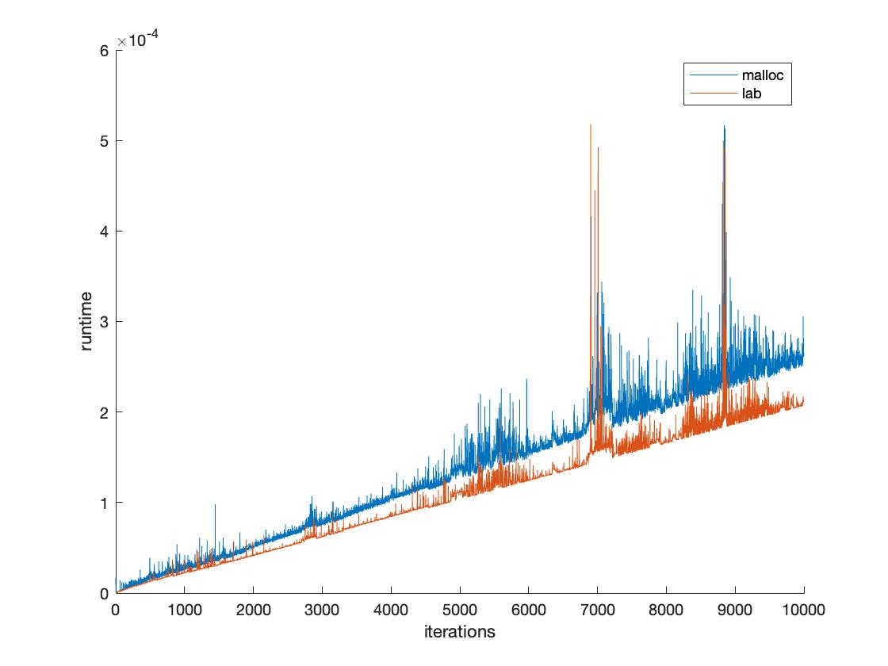

## Вариант 13: Следующий подходящий. Двухсвязный список. (2)

Реализуйте систему управления памятью, построенную на списках пустых блоков. Используйте
двухсвязный список и стратегию “Следующий подходящий”.
Напишите функции выделения и освобождения памяти блоками произвольного размера.
Сравните производительность вашей системы с стандартным malloc/free

## Сравнение результатов

В тестах замерялось время совершения n итераций, состоящих из алоцирования блока
рандомного размера и его освобождения. Видно, что написанная в лабораторной система
работает быстрее.
